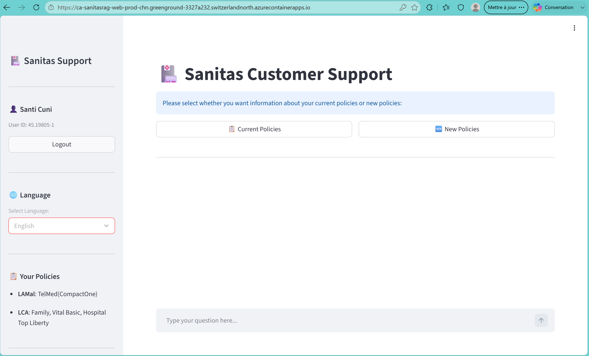
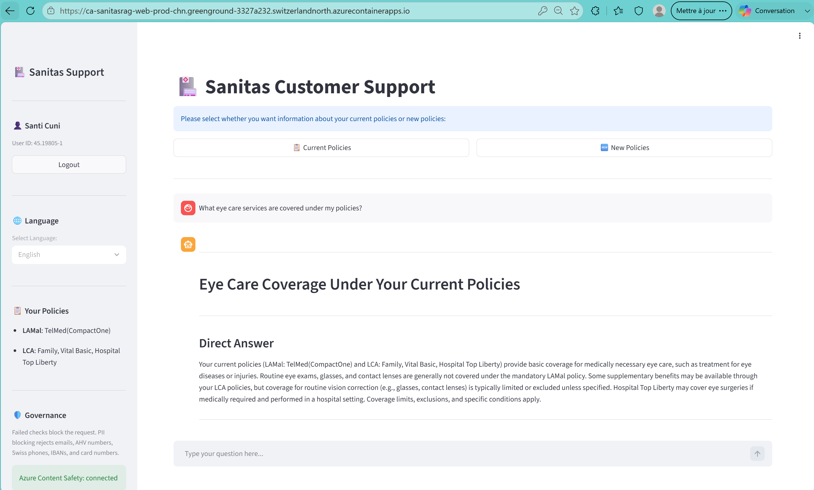
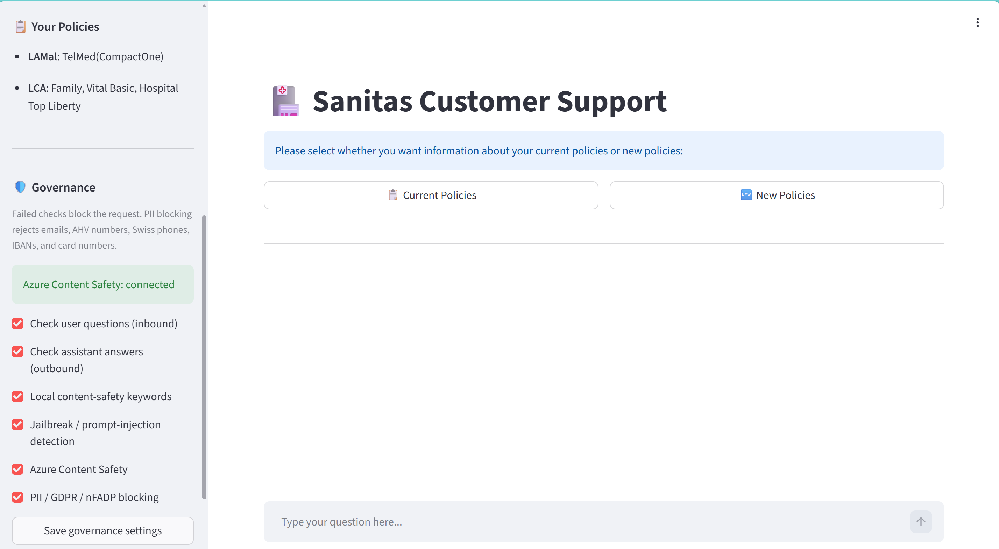
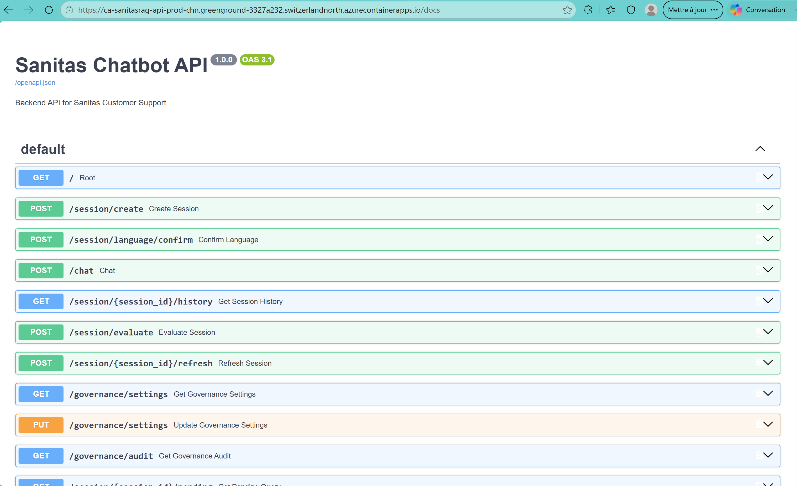
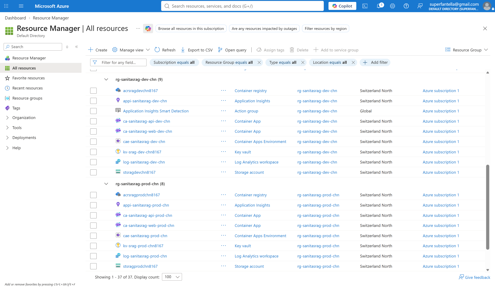

# Insurance RAG — LLMOps

Multilingual **customer-support RAG** for **basic and complementary health insurance** (EN / FR / DE / IT). Advisors and customers ask coverage questions; the system answers only from indexed policy documents (knowledge base).

Application source is **private**. This public repo is the **product + LLMOps story** for recruiters and interviewers.

---

## Project summary

| | |
|---|---|
| **What** | RAG chatbot: Streamlit UI + FastAPI, hybrid search, grounded `gpt-4.1` answers |
| **For whom** | Swiss-style insurance support (current vs new policies, 4 languages) |
| **Ops** | Isolated **Dev** and **Prod** on Azure Container Apps, shared AI/data plane, GitHub promotion |

**Live demo**

| | UI | API |
|---|---|---|
| **Dev** | [Web](https://ca-sanitasrag-web-dev-chn.braveisland-7adede75.switzerlandnorth.azurecontainerapps.io/) | [Swagger](https://ca-sanitasrag-api-dev-chn.braveisland-7adede75.switzerlandnorth.azurecontainerapps.io/docs) |
| **Prod** | [Web](https://ca-sanitasrag-web-prod-chn.greenground-3327a232.switzerlandnorth.azurecontainerapps.io/) | [Swagger](https://ca-sanitasrag-api-prod-chn.greenground-3327a232.switzerlandnorth.azurecontainerapps.io/docs) |

**Docs to read first**

| Doc | Topic |
|---|---|
| [docs/Architecture.md](docs/Architecture.md) | Request path and environments |
| [docs/GOVERNANCE.md](docs/GOVERNANCE.md) | PII, Prompt Shields, adversarial soft report |
| [docs/MONITORING.md](docs/MONITORING.md) | App Insights workbook, SLOs, CD gates |

---

## Tech stack

- **App:** Streamlit, FastAPI, LangGraph orchestrator  
- **RAG:** Azure AI Search (hybrid + rerank), Azure Document Intelligence, Blob Storage  
- **LLM:** Azure AI Foundry / OpenAI (`gpt-4.1`, `text-embedding-3-small`)  
- **State:** Azure Redis (sessions), Cosmos DB (profiles + history)  
- **Safety:** Azure Content Safety, **Prompt Shields**, PII gates (GDPR / Swiss nFADP-oriented)  
- **Run:** Docker, Azure Container Registry, Azure Container Apps  
- **Observe:** Log Analytics + Application Insights workbook (per environment)  
- **Eval:** MLflow on Azure ML; Prod golden hard gate; adversarial soft report  
- **Deliver:** GitHub Actions, OIDC to Azure (no long-lived deploy passwords)

---

## Architecture

```text
Browser → Streamlit (web Container App)
       → FastAPI (api Container App)
            → Governance IN  → Search → gpt-4.1 → Governance OUT
       → Redis + Cosmos

GitHub (private) --OIDC--> Dev RG | Prod RG
Both apps call shared Foundry + Search + Cosmos + Redis
```

More detail: [docs/Architecture.md](docs/Architecture.md).

---

## Screenshots / demo

| Preview | File |
|---|---|
| Chat UI |  |
| Grounded answer |  |
| Governance block |  |
| Swagger `/docs` |  |
| Dev vs Prod RGs |  |
| RAG orchestrator |  |
| Governance orchestrator |  |  

---

## My contributions

Solo build (product + platform), including:

- End-to-end RAG for Swiss insurance PDFs (ingest → index → retrieve → generate)  
- Multilingual UI and policy-type flow (current vs new)  
- Governance/guardrails on the live chat path (PII, Content Safety, Prompt Shields), configurable from the UI  
- Prod monitoring workbook (Health / RAG / Governance / Cost + dig-down by `operation_Id`)  
- Eval in CD: golden hard gate + adversarial soft report (MLflow)  
- LLMOps: two Azure environments, CAF naming, secrets on Container Apps  
- Shared vs isolated resource split (cost vs blast radius)  
- CI tests + CD (`dev` → Dev, `main` → Prod with approval)

---

## Results / impact

What is in place and working:

- **Dev and Prod** both serve the API (`/docs`) and the UI  
- Answers grounded in `policy_index`, not a generic chatbot  
- Unsafe/PII turns can be **blocked** without calling the LLM  
- A bad Dev image cannot overwrite Prod (separate ACR + apps)  
- Secrets are not in git; they live as Container App `secretref`s  
- Live ops KPIs and CD eval gates are defined and wired  

---

## Challenges solved

- **TLS 1.0/1.1 retirement** on new storage accounts → **TLS 1.2** only  
- **Same Docker layout** as the original `Production.*` imports  
- **Secrets vs env vars:** secrets do nothing until mapped with `secretref:`  
- **Jailbreak / system-bypass** beyond English regex → Azure **Prompt Shields** as primary multilingual control  

---

## Trade-offs

| Choice | Trade-off |
|---|---|
| Share OpenAI / Search / Cosmos across Dev and Prod | Lower cost, same answers; Dev can touch Prod-like data |
| Isolate hosting only (two RGs, two ACRs) | Safer deploys; more resources to operate |
| Container Apps | Fits RAG serving; less “cluster ops” than AKS |
| Two environments, not three (no staging) | Simpler; no extra pre-prod ring |
| Block on PII instead of redact | Safer default; legitimate PII in questions gets blocked unless toggled off |
| Public repo without application Python | Safer for credentials and IP |

---

## What I would improve next

1. **Data isolation:** optional Dev index / Cosmos so Prod data is never used in experiments  
2. **Private networking** for real Prod (VNet, private endpoints)  
3. **Deeper eval:** faithfulness / relevancy judges as an additional deploy signal  
4. **Key Vault references** instead of Container App secrets only  
5. **Workbook polish:** denser metric rows (less scrolling) once telemetry stamps are fully consistent in Prod  

---

## What is not in this repository

Application Python, Dockerfiles used to ship the app, `.env`, and secret scripts. Available in a private repo for technical interviews.

Setup / assumption notes under `docs/` (e.g. Azure platform setup) are optional deep dives — start with Architecture, Governance, and Monitoring above.
