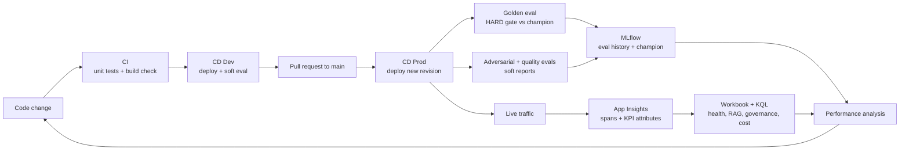

# LLMOps — how CI/CD, monitoring and performance work together

This document explains the **logic** behind the operational side of the AI_RAG solution and how its three parts feed each other:

- **CI/CD** decides whether a change is allowed to reach production.
- **Monitoring and observability** show what the change does once it is live.
- **Performance analysis** turns those signals into the next change.

They are not three separate tools: they share the same signals (evaluation runs, OpenTelemetry spans, KPI attributes), so a problem found in one place can be traced in the others.

---

## 1. The loop at a glance



Every arrow carries data that the next step uses. The rest of this document explains why each step exists and what it hands to the next one.

---

## 2. CI/CD — every change has to prove itself

### The logic

| Stage | Trigger | What it proves | If it fails |
|---|---|---|---|
| **CI** | Pull request to `dev` / `main`, push to `dev` | Governance unit tests pass and the production Docker layout assembles | Merge is blocked |
| **CD Dev** | Push to `dev` | The image deploys and answers on a real Azure environment; a dev dataset eval is logged | **Soft gate**: results are logged, the workflow continues so the team can iterate |
| **CD Prod** | Merge to `main` | The new revision answers the golden dataset at least as well as the current champion | **Hard gate**: the workflow fails and the change is not accepted |

Design choices behind it:

- **No stored cloud secrets.** GitHub Actions logs in to Azure with OIDC (federated identity); the pipeline never holds a long-lived password.
- **Traceable images.** Every image is tagged with the git commit SHA, so any running revision maps back to the exact code.
- **Dev is for learning, Prod is for protecting.** Dev evaluations never block; Prod evaluation blocks when quality regresses.
- **Separate questions, separate suites.** Golden (does it still answer?), adversarial (does governance still block attacks?) and quality (are answers relevant and grounded?) run as independent jobs, so one weak signal does not hide another.

### Extract — the Prod hard gate (`.github/workflows/cd-prod.yml`)

```yaml
eval-prod-golden:
  needs: deploy-prod
  environment: prod
  env:
    RG: rg-insurancerag-prod-chn
    API: ca-insurancerag-api-prod-chn
    AML_WORKSPACE: aml-insurancerag-prod-chn
    DATASET: data/Dataset/dataset_tests_225_prod_golden.groovy
  steps:
    - name: Run PROD golden dataset eval (hard gate)
      run: |
        ARGS=(
          --dataset "$DATASET" --env prod
          --golden-gate
          --min-pass-rate "$MIN_RATE"
          --max-drop-pp "$MAX_DROP"
          --max-empty-retrieval-rate "$MAX_EMPTY"
        )
        python scripts/eval/run_dataset_eval.py "${ARGS[@]}"
```

The evaluation job only starts after the deploy job succeeds (`needs: deploy-prod`), and it tests the **live** revision through its public API, not a mock. The thresholds are GitHub environment variables, so they can be tuned without changing code.

### Extract — what "pass" means (`scripts/eval/run_dataset_eval.py`)

```python
if args.golden_gate and not soft_report:
    if pass_rate < args.min_pass_rate:
        gate_failed = True
        gate_reasons.append(f"pass_rate {pass_rate:.4f} < min {args.min_pass_rate}")
    if empty_retrieval_rate > args.max_empty_retrieval_rate:
        gate_failed = True
        gate_reasons.append(f"empty_retrieval_rate {empty_retrieval_rate:.4f} > max ...")
    champion = get_champion_pass_rate(experiment_id)
    if champion is not None:
        drop_pp = (champion - pass_rate) * 100.0
        mlflow.log_metric("eval.drop_pp_vs_champion", drop_pp)
        if drop_pp >= args.max_drop_pp:
            gate_failed = True
```

A build has to pass **three** checks: an absolute floor (minimum pass rate), a retrieval health check (not too many empty retrievals), and a **relative** check against the best previous run (the MLflow "champion"). The relative check is what catches slow regressions that still look "good enough" in absolute terms. Every result, pass or fail, is written to MLflow with its reasons, so the history of quality is kept per commit.

**Connection to monitoring:** every evaluation request is tagged (`eval.suite`, `eval.run_id`), so the same calls also appear in the production dashboards and can be inspected span by span.

---

## 3. Monitoring and observability — one signal from pipeline to production

### The logic

Three layers answer three different questions:

| Layer | Tool | Question it answers |
|---|---|---|
| **Live operations** | Application Insights + Azure Monitor workbook **LLMOps Metrics** (per environment) | Is the system healthy right now? Is it degrading? |
| **Evaluation / promotion** | MLflow on Azure ML + GitHub Actions summaries | Did this build pass golden, adversarial and quality evaluations? |
| **Dig-down** | `operation_Id` in the workbook | Which exact call failed, and what happened inside it? |

Dev and Prod each have their own Log Analytics workspace and Application Insights resource. Hosting is isolated per environment; the AI and data plane can be shared.

The workbook is organised around three questions an operator asks in order: **Is something wrong?** (glance KPIs) → **Where?** (Health, RAG, Governance, Cost sections) → **Which call?** (dig tables down to the single request).

| Area | What it shows |
|---|---|
| **Glance** | Chats, success %, p95, empty retrieval %, exceptions, short trends |
| **Health** | Failed `/chat` requests and exceptions over time |
| **RAG** | Answer mix, empty retrieval by language, language / policy distribution, retrieval and stage latency |
| **Governance** | Block %, blocking stage, trend; adversarial tags and reactions when evaluation tags are present |
| **Cost** | LLM, embeddings and Search estimates (CHF), CHF per chat, breakdown |
| **Dig** | Blocked · empty · slow · failed calls → full pipeline for the selected `operation_Id` |

### Instrumentation: spans for each stage, KPIs on the request

Each step of the RAG pipeline (retrieval, embedding, search, LLM generation, input/output governance) is wrapped in an OpenTelemetry span, so its duration and outcome are measured separately.

Extract — the span helper (`src/telemetry_context_insurance.py`):

```python
@contextmanager
def span_perf(name: str, attrs: Optional[Dict[str, Any]] = None) -> Iterator[Any]:
    """
    Important: never catch exceptions raised by the caller's body. Doing so breaks
    the generator protocol and drops parent spans such as workflow.process_message,
    which breaks dashboard denominators.
    """
    tracer = trace.get_tracer(__name__)
    span_cm = tracer.start_as_current_span(name)
    span = span_cm.__enter__()
    try:
        for k, v in (attrs or {}).items():
            set_span_attr(span, k, v)
        yield span
    finally:
        span_cm.__exit__(*sys.exc_info())
```

The docstring records a real production lesson: an earlier version swallowed exceptions inside the span helper, which silently dropped the parent workflow span and made the dashboard rates wrong. The fix is a constraint written into the code.

Extract — KPI stamping on the chat request (`src/agent_orchestrator_insurance.py`):

```python
chat_kpi = {
    "rag.answer_class": answer_class,          # answered / no_answer / blocked
    "rag.retrieval.empty": bool(final_state.get("retrieval_empty")),
    "rag.retrieval.hit_count": int(final_state.get("retrieval_hit_count") or 0),
    "governance.blocked": bool(final_state.get("governance_blocked")),
    "governance.stage": final_state.get("governance_block_stage") or "",
    "rag.chat.duration_ms": float(chat_total_ms),
}
if eval_suite:
    chat_kpi["eval.suite"] = eval_suite
stamp_current_span(chat_kpi)
```

**Why this matters (the denominator rule):** all KPIs are stamped on the HTTP `POST /chat` request itself. If a run has 150 chats, the success rate, the empty-retrieval rate and the governance block rate are all computed over those same 150 rows. Rates cannot disagree with each other because one nested span was lost. A coverage tile in the workbook checks this continuously by comparing HTTP chats, chats with stamped KPIs, and workflow spans.

**Connection to CI/CD:** evaluation traffic carries `eval.suite`, so the dashboards can show production users and pipeline evaluations separately, and an evaluation failure seen in GitHub can be opened in Application Insights to see what happened at each stage.

---

## 4. Performance analysis — from a number to a decision

### The logic

Performance is judged against explicit targets, then broken down by stage to find where time or quality is lost.

| KPI | Prod target |
|---|---|
| Chat success rate | ≥ 95% |
| p95 chat duration | ≤ 20 s |
| Empty retrieval rate | ≤ 15% |
| Exceptions | Near 0 |
| Governance block rate | Own section; context-dependent (higher by design during adversarial evaluation) |
| Cost per chat | Watched against the recent median |

### Extract — stage duration breakdown (KQL, Application Insights)

```kusto
dependencies
| where timestamp > ago(7d)
| where name in ("rag.retrieve_context", "llm_chat.generate_response", "workflow.process_message")
| summarize
    avg_s = round(avg(duration) / 1000, 2),
    p95_s = round(percentile(duration, 95) / 1000, 2)
    by name
| order by avg_s desc
```

This query uses the spans from section 3 to show which stage drives latency (retrieval vs LLM generation vs the whole workflow). A slow p95 is therefore not a guess: it points at a specific stage.

### Example — testing a hypothesis with the pipeline

A quality report showed some answers with low **Contextual Relevancy** (the retrieved chunks contained text unrelated to the question). The hypothesis was that sending fewer chunks to the LLM would help.

1. **Change without rebuilding.** The number of chunks kept after ranking is an environment variable (`FINAL_TOP_K`), so it was changed from 3 to 2 by deploying a new Container Apps revision, with no new image.
2. **Measure with the same suite.** The quality evaluation (Answer Relevancy, Faithfulness, Contextual Relevancy, LLM-as-judge) was run on the same cases with top-k = 2 and top-k = 3.
3. **Decide from data.** There was no meaningful difference between the two settings. The conclusion: the limit is **retrieval precision** (which chunks are found), not how many are sent. The next improvement therefore targets retrieval, not generation.

This is the loop from section 1 in practice: a monitoring signal led to a hypothesis, the CI/CD tooling tested it safely, and the result decided the next change.

---

## 5. How the pieces connect

| Signal | Produced by | Read by | Decision it drives |
|---|---|---|---|
| Golden pass rate vs champion | CD Prod evaluation → MLflow | Hard gate | Accept or reject the release |
| Adversarial reactions (blocked / answered), defense rate by attack type | CD Prod evaluation → MLflow + workbook | Governance section (see [GOVERNANCE.md](GOVERNANCE.md)) | Tune governance rules |
| Quality scores + judge reasons | CD Prod quality suite → report + MLflow | Engineer | Choose the next retrieval / prompt change |
| Stage spans (retrieve, LLM, governance) | OpenTelemetry in the API | KQL + workbook | Find the slow or failing stage |
| KPI attributes on `POST /chat` | API request span | Workbook glance tiles + alerts | Detect degradation in production |
| Revision status + image SHA | Azure Container Apps | Operator | Roll back or redeploy the exact commit |

---

## Related documents

- [Architecture](Architecture.md)
- [Governance](GOVERNANCE.md)
- [Azure implementation](Azure_Implementation.md)
- [Design assumptions](Design_Assumptions.md)
